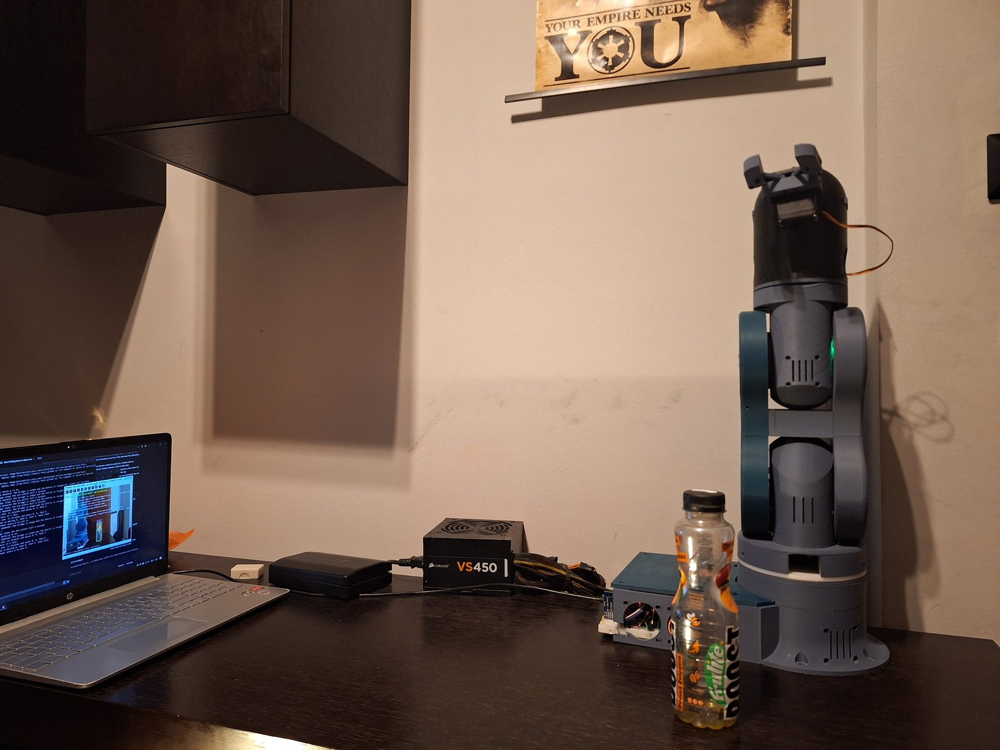
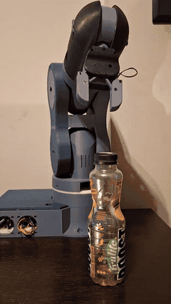
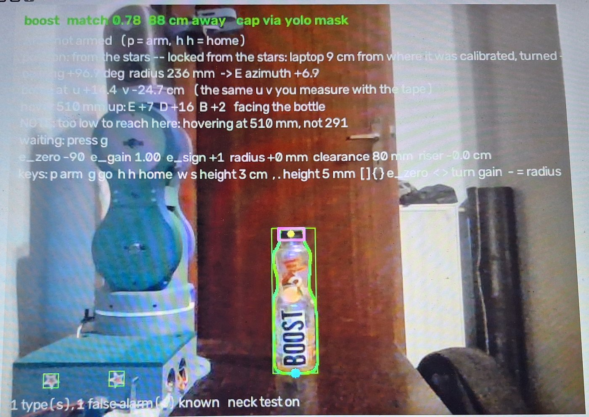
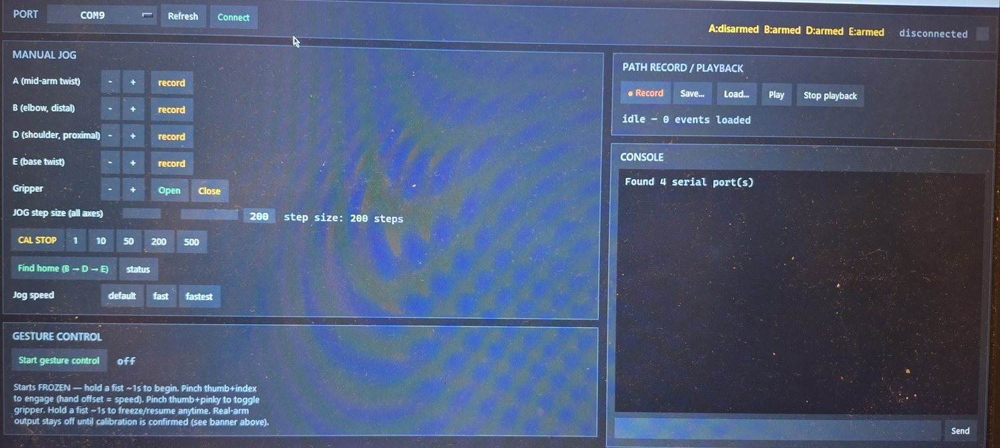
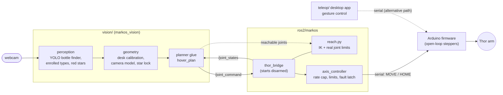
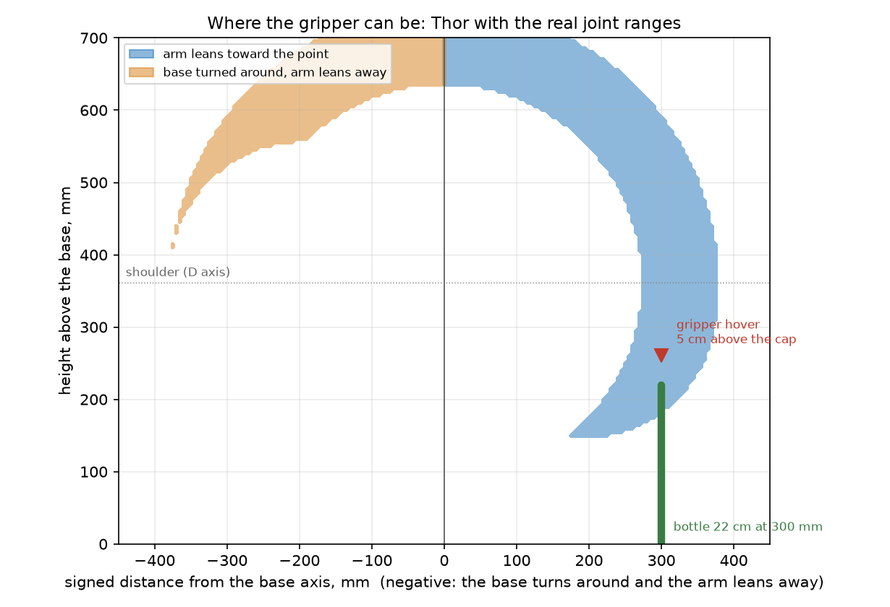

# maRkOS

**Camera-guided control of the open-source [Thor](https://github.com/AngelLM/Thor) robotic arm**: custom firmware, a desktop
gesture-teleoperation app, a ROS 2 bridge with safety interlocks, and a vision pipeline that finds a bottle on the desk, works out where
it stands to within a centimetre, and moves the gripper over its cap.


<p align="center">
  
  <br><em>The setup: the Thor arm on its electronics box, the bottle it follows, and the laptop whose webcam is the only sensor.</em>
</p>

## In action

<table>
  <tr>
    <td align="center" width="260"></td>
    <td align="center"></td>
  </tr>
  <tr>
    <td valign="top"><sub>The arm follows the bottle as it is moved by hand. <a href="docs/videos/hover-demo.mp4">Full clip (21 s, mp4)</a>.</sub></td>
    <td valign="top"><sub>The hover window: the bottle recognised as the enrolled <em>boost</em> with its cap located from the YOLO outline, the two red stars on the robot's base found (green boxes), and the joint angles the planner would send. Here the bottle stands too close to the base for an exact hover, so the planner reports it would hover higher. The bridge is not armed and <code>g</code> is off: nothing moves until both are on.</sub></td>
  </tr>
  <tr>
    <td colspan="2" align="center"><br><sub>The desktop teleoperation app (Mark1OS): manual jog per axis, homing, path record and playback, and gesture control with a webcam.</sub></td>
  </tr>
</table>

## What is in here

| Part | What it does | Where |
|---|---|---|
| **Firmware** | Arduino Mega sketch: blocking `MOVE`/`JOG`/`HOME` commands over serial, soft limits, homing against optical beacons | [`firmware/`](firmware) |
| **Desktop teleop** | Tkinter console; drive the arm with one hand in front of a webcam (MediaPipe), record and replay paths | [`teleop/`](teleop) |
| **ROS 2 bridge** | `thor_bridge` node: homes the arm, publishes its position, executes joint commands only while armed; reach planner; firmware simulator | [`ros2/markos`](ros2/markos) |
| **Vision pipeline** | Finds the bottle (YOLO11 segmentation), places it on the desk from a tape calibration, plans the hover, drives the bridge | [`vision/`](vision) |
| **Launchers** | One-click start, arm, home and stop for Windows + WSL2 | [`scripts/`](scripts) |

**Status.** The arm hovers over a bottle it sees, 5 cm above the cap, and follows it around the workspace. Closing the gripper on the cap is
the next milestone (see the [roadmap](#roadmap)); the gripper hardware and its firmware command already work.

## How it fits together



The stepper motors have no position feedback, so the whole system is built around what that costs: the arm is homed at start-up, the bridge
refuses to move it until it is homed and explicitly armed, any lost acknowledgement latches a fault, and the planner refuses joint angles
outside the ranges measured on the real arm. [Architecture and design decisions →](docs/architecture.md)

### What the arm can reach

<p align="center">
  
  <br><em>The region the gripper can actually reach, computed by the planner from the arm's measured joint ranges. The red marker is the
  hover point 5 cm above the cap of a 22 cm bottle.</em>
</p>

## Quick start (no arm needed)

```bash
git clone https://github.com/KonstantinosSpe/maRkOS.git && cd maRkOS
python -m venv .venv && source .venv/bin/activate          # Windows: .venv\Scripts\activate
pip install -e ".[dev,headless]"                           # headless OpenCV: no display needed
pytest                                                     # ~190 tests, about a minute
```

The tests need no camera, no arm and no ROS: synthetic cameras with lens distortion and pixel noise check the calibration against known
truth, and the real hover loop runs against a fake camera and a fake bridge. With ROS 2 installed the same command also runs the bridge test
against the firmware simulator. [Testing →](docs/testing.md)

To watch the planner drive the arm model with no hardware (ROS 2 required):

```bash
scripts/wsl/build_ros.sh                       # build the two ROS packages once
MARKOS_MOCK=1 scripts/wsl/start_bridge.sh      # a bridge talking to a simulated Arduino (its own terminal)
scripts/wsl/rviz.sh                            # the arm in RViz (its own terminal)
scripts/wsl/arm.sh                             # even the simulated arm only moves once armed
scripts/wsl/start_hover.sh --simulate 30,335 --sweep 20 --go     # a made-up bottle swinging +/-20 degrees, no camera
```

## With the arm

Setup on Windows 10/11 with WSL2 (USB devices are handed to WSL with `usbipd-win`) is in [docs/setup.md](docs/setup.md). Day to day:

1. `scripts\windows\Start Thor.bat`: attaches the camera and the Arduino, **homes the arm**, opens the hover window.
2. Put the bottle in view; when it is recognised and steady run `Arm Thor.bat` and press `g` in the hover window.
3. `Disarm Thor.bat` (or `g` again) stops the arm at once; `Stop Thor.bat` closes everything.

[Operating guide →](docs/operating.md) · [Calibration →](docs/calibration.md) · [Hardware notes →](docs/hardware.md)

## Results

Measured on the author's setup (laptop webcam about 1 m from the arm, one 22 cm bottle):

| | |
|---|---|
| Desk calibration | 11 bottle positions measured with a tape; worst fit 5.9 mm, held-out (leave-one-out) median 5.8 mm, worst 13.3 mm |
| Camera fitted from those spots and the two red stars | reprojection error 1.1 px |
| Moved laptop, in simulation | bottle placed to within about 3 mm after moving the camera 30 to 70 cm, using only the two stars (0.3 px calibration noise) |
| Aim probe (finds where the gripper really goes), in simulation | 5 to 13 cm start-up misses corrected to about 2 mm |

The simulated figures come from the test suite and are reproducible with `pytest`; the calibration figures come from the author's own
calibration file.

## Repository layout

```
firmware/         Arduino sketches (thor_teleop_firmware, pin_scanner)
teleop/           desktop teleoperation app (Tkinter + MediaPipe), step-accuracy tools and their measurements
ros2/             colcon workspace sources: markos (bridge, planner, simulator) and thor_urdf (robot model for RViz)
vision/           markos_vision: perception, geometry and calibration, apps; experiments/ holds earlier prototypes
scripts/          wsl/ and windows/ launchers, plot_reach_envelope.py
docs/             architecture, hardware, setup, operating, calibration, testing, development; images/ and videos/ hold the showcase media
data/             per-machine calibration, enrolled bottles, models and logs (git-ignored; see data/README.md)
```

## Roadmap

- [x] Firmware with homing, soft limits and blocking moves; desktop gesture teleoperation
- [x] ROS 2 bridge with arming interlock, fault latching and a firmware simulator
- [x] Hardware constants measured on the real arm (directions, steps per degree, gripper geometry)
- [x] Camera calibration from tape-measured spots; laptop can be moved (two red stars); bottle-diameter correction
- [x] Hover 5 cm above a recognised bottle
- [ ] Run the aim probe on the arm and apply its correction (implemented and validated in simulation)
- [ ] Close the gripper on the cap, lift and place
- [ ] Positional (go-to-pose) teleoperation mode and more responsive gesture control
- [ ] Fan control (not wired up yet)
- [ ] Verify step drift on the arm (`drift_test` is written, not yet run)

## Credits and license

The arm is [Thor](https://github.com/AngelLM/Thor) by AngelLM; the robot model in `ros2/thor_urdf` comes from
[Thor-ROS](https://github.com/AngelLM/Thor-ROS). Third-party terms are in [NOTICE.md](NOTICE.md). The code in this repository is
released under the [MIT License](LICENSE).
