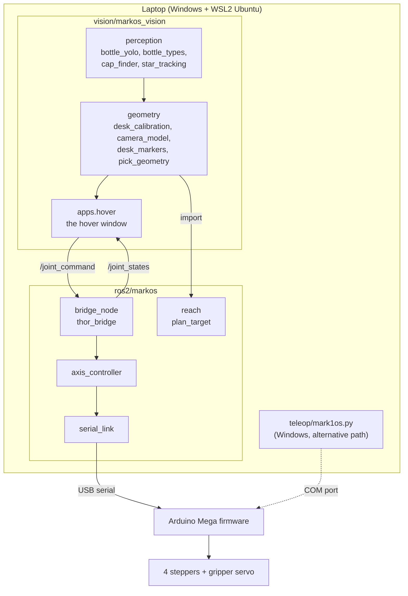

# Architecture

## The pieces and what crosses between them

* **Two ways to drive the same firmware.** The desktop app (`teleop/`) talks to the Arduino directly from Windows: a console, hand
  gesture control, path record and replay. The ROS 2 path puts one process, `thor_bridge`, in charge of the serial port and lets any other
  node command the arm through topics. Only one of them may own the port at a time.
* **`markos` (ROS package) has no dependency on the vision code**, and the vision code uses only its pure parts (`reach`, `hw_config`):
  the planner and the safety logic are testable without ROS, a camera or an arm.

## Conventions

| Thing | Convention |
|---|---|
| Desk frame (vision) | origin on the robot's base axis; **+x to the right as the camera sees it, +y toward the camera**, centimetres. Bearing is `atan2(x, y)`: 0 straight toward the camera, positive to the right |
| Measuring frame `u, v` | what the tape gives: `u` to the right of the right-hand corner of the robot box's end face, `v` toward the laptop from that face. The axis is built in at `(-9.0, -21.9)` (from the Thor CAD) |
| Planner | azimuth `= e_sign * bearing + e_zero_deg`; radius from the base axis in mm; height in mm **above `base_link`**, the surface the robot is bolted to |
| Joints | `E` base twist, `D` shoulder hinge, `B` (`BC` in ROS) elbow hinge, `A` upper twist (never driven). Angles are in the model's convention; `hw_config.SIGN` says which axes run the other way on the real arm |
| Lean | the arm can reach a point leaning toward it (`toward`) or with the base turned around leaning away (`away`) |

## Perception

1. **`bottle_yolo.YoloBottleFinder`** runs YOLO11n-seg (COCO class *bottle*) and keeps a stable ID per detection. A detection is believed
   only if it (a) looks like an enrolled bottle type (`bottle_types`: colour signature, and a neck-to-body ratio that a straight column
   such as the robot's own arm cannot pass), and (b) is not a marked false alarm. The outline gives the cap position and the point where
   the bottle meets the desk.
2. **Identity latch.** The arm hovering over the bottle casts a shadow that changes its colours enough to fail (a) on the next re-check
   and make the program stop halfway. A recognised bottle therefore keeps its identity while its foot stays within a small distance of
   where it was recognised (12 % of its height, at most 90 s); a bottle that moves, or a different track, is recognised afresh.
3. **`star_tracking.StarTracker`** finds the two red stars on the robot's base by template matching with sub-pixel refinement. They are
   fixed and 7.9 cm apart, so where they appear tells where the camera is.

## Geometry and calibration

* **`DeskCalibration`** maps the pixel where the bottle meets the desk to a position around the base axis with a single homography, fitted
  to bottle positions measured with a tape. That replaced working the position out from apparent sizes, where a pixel of error in the stars'
  7.9 cm spacing became about 15 mm of distance. The calibration reports its own quality (fit error, leave-one-out error, coverage advice).
* **`CameraModel` / `fit_calibration_pose`** fit a pinhole camera with radial lens bend to the tape spots and the stars. The picture alone
  cannot separate a higher camera from a farther one, so the lens height is measured once with a ruler and pins the fit.
* **`StarLock`** places a *moved* laptop from the two stars alone (position, turn and tilt, with focal length, lens bend and height fixed
  from calibration) and hands the calibration a new pixel-to-desk mapping (`carry_over_mapping`) that keeps the tape's accuracy. It refuses
  implausible answers (stars that do not fit, a tilt change that hides a height change, a move too big to believe), notices a bump, and
  locks again by itself. Printed ArUco markers (`desk_markers`) are an alternative that needs no star measurements.
* **The bottle's near edge.** The camera sees the lowest point of the bottle's round foot, its *near edge*, while the tape measures to the
  *centre*. The calibration bottle's diameter is stored, the camera is fitted with the foot modelled (fitting the edge as if it were the
  centre skews the camera position by several centimetres), and a bottle of another width is corrected by half the difference in the
  direction away from the camera. Details and figures: `vision/tests/test_bottle_diameter.py`.

## Planning

`pick_geometry.hover_plan` turns a bearing and radius into joint angles by asking `markos.reach.plan_target` for the exact hover point.
`reach` solves the planar two-link problem and **rejects every answer outside the joint ranges measured on the real arm**, so a target
either comes back with angles the arm can hold or is refused. When the exact point is out of reach the planner does not give up: it goes
to the nearest reachable spot, weighing a sideways miss ten times heavier than extra height (staying over the bottle matters more than
staying low). It also keeps to one lean until the other pose gets 150 mm closer, so a bottle sliding across the workspace does not swing
the base around and back.

## The hardware layer and its safety model

Stepper motors here are **open loop**: nothing reports where the arm really is, so a lost step is invisible. The design accepts that and
constrains everything around it.

* The firmware **blocks** during a move, so the controller sends short moves (at most 40 steps per axis, 20 for the coarser B) and never has to interrupt one.
* `thor_bridge` **starts disarmed** and cannot be armed before every axis is homed, while homing runs, or while a fault is latched.
* Any fault (a lost acknowledgement, a firmware direction that disagrees with `hw_config`) disarms the node and keeps it refused until the
  arm has been re-homed.
* Commands stop being chased half a second after the last one arrives; targets beyond an axis's mechanical range are clamped.
* The hover window sends nothing unless the bottle is recognised, has held steady for a few frames and `g` is on; the camera moving since
  calibration blocks it too. Arming and `g` are deliberately separate, and the window refuses to arm while `g` is on (arming with `g` on
  would move the arm at once).
* Axis A loses steps under load and has no home sensor, so it is never driven from software.

## Design decisions

| Decision | Why |
|---|---|
| One source of truth for measured constants (`markos.hw_config`); the bridge parameters and the planner's limits are derived from it | The bridge and the planner both need the axis signs and step scales; keeping them in one place stops the two from drifting apart |
| Homography from tape spots instead of apparent size | Removes the amplification of the star spacing's pixel noise |
| Differential star trick: remember how the stars' pixels disagreed with the fitted camera at calibration and subtract it later | The stars sit only about 3.5 cm above the desk; a 2 mm error in their measured position would otherwise cost 2 to 4 cm after a move |
| Planner returns `None` for unreachable, callers may ask for the nearest reachable | The generic IK clamps and never says no, which hid that most of the workspace is not reachable |
| Vision tests use synthetic cameras with known truth | The camera-facing code cannot be verified against a real arm in CI; a simulated camera with distortion and noise can check the maths |
| Paths come from one config module | The first version had absolute home-directory paths in nearly twenty files |

## Known limitations

* Positions come from one camera; there is no feedback from the arm, so accuracy is bounded by the calibration (worst fit error about
  6 mm on the author's setup) plus whatever the steppers lose.
* `teleop/hw_config.py`, `teleop/ik.py` and `ros2/markos/markos/hw_config.py`, `reach.py` overlap in purpose and have drifted apart on
  purpose (the ROS side carries the newer measured scales). `vision/experiments/arm_ik.py` is a trimmed copy of `teleop/ik.py`.
  Unifying them behind one package is the natural next refactor.
* `apps/hover.py` is a long file that mixes the ROS link, the key handling and the frame loop.
* Only one bottle type has been used on the real arm.
